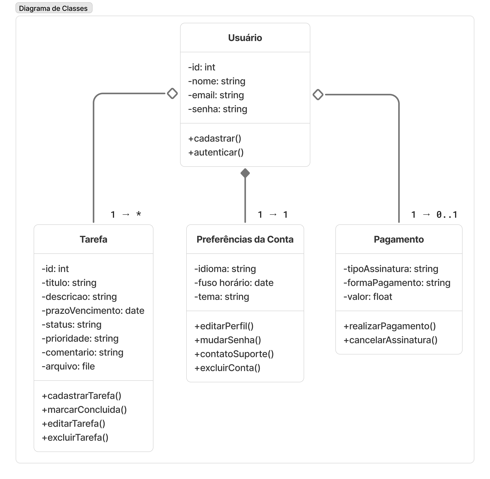
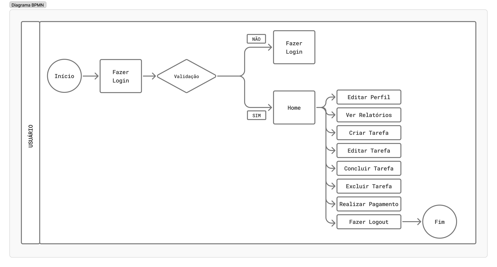
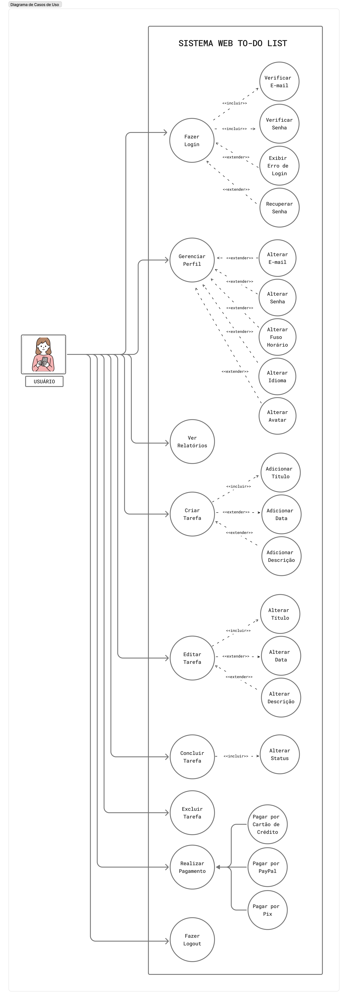

## Documento de Requisitos - Ergo To-Do List

---

**Histórico de Alterações**

  
|       Data      |   Versão   |             Descrição              |        Autor        |
|:---------------:|:----------:|:----------------------------------:|:-------------------:|
|   09/07/2025    |     V1     |   Versão Inicial da Documentação   |   Letícia Comério   |

 

---

**1. Introdução**
  
**1.1 - Objetivo**

Este documento de requisitos define os principais aspectos do Ergo (que em grego significa "Tarefa"), sistema web de To-Do List para gerenciamento de tarefas online, fornecendo base sólida para o desenvolvimento da solução. Ele reflete as necessidades identificadas pela equipe de análise de requisitos e pelos stakeholders, garantindo que o sistema atenta às expectativas, além de fornecer conhecimento para o desenvolvimento, orientando os desenvolvedores nas funcionalidades necessárias. Novas atualizações e revisões periódicas com feedback contínuo e ajustes serão incluídas nos versionamentos deste documento para rastreabilidade.
  
**1.2 - Escopo**

O objetivo do sistema é auxiliar usuários na organização, acompanhamento e gerenciamento de suas tarefas cotidianas. Assim, deve contribuir para facilitar a execução das listas de afazeres, auxiliando no cumprimento de prazos e disponibilizando recursos que proporcionem praticidade para o usuário.
Cada usuário pode se cadastrar no sistema informando seu nome, e-mail e senha, sendo que cada conta é individual e protegida por autenticação segura de dois fatores por e-mail. Após o cadastro, o usuário deve conseguir redefinir a senha caso queira ou esqueça. 

Ao entrar no sistema, o usuário acessa seu painel de tarefas, onde pode criar, editar, excluir e visualizar suas tarefas, além de visualizar relatórios. Cada tarefa possui informações como título, descrição, data de vencimento, prioridade, status e, opcionalmente, uma categoria. Pode também fazer upload de arquivos e incluir comentários.

As tarefas são organizadas por categorias, que também são criadas e gerenciadas pelos próprios usuários. Isso permite que cada um personalize seu ambiente de organização, separando tarefas por contextos como trabalho, estudos ou pessoal.

O sistema permite que o usuário acompanhe o status das tarefas, que podem estar como pendente, em andamento, concluída ou cancelada. Também oferece filtros para visualização das tarefas por status, data de vencimento, prioridade e categoria, facilitando o controle e o planejamento.

O sistema enviar notificações sobre tarefas próximas do vencimento para a conta e/ou e-mail, mantendo os usuários informados e ajudando na gestão do tempo.

Todo o ambiente do sistema é seguro, com senhas criptografadas, e é responsivo, adaptando-se tanto para desktop quanto para dispositivos móveis, garantindo uma boa experiência de uso. Há dois tipos de planos, o gratuito, com limitações de uso, e o pago.
Não está incluso na primeira versão integrações com ferramentas externas, compartilhamento e colaboração de tarefas com outros usuários e exportação dos dados das tarefas para usos externos. 

O sistema deve ser usado via navegador, não sendo disponibilizado aplicativo mobile. 
   
**2. Descrição Geral**

Ergo To-Do List é um sistema novo para quem dispensa papel e caneta e precisa de praticidade e ter à mão a qualquer momento sua auto-organização de forma prática. 

Atualmente as pessoas possuem muitas ações para fazer durante o dia e saber usar o tempo é essencial para ajudar na produtividade. O público-alvo do sistema são usuários finais pessoas físicas para uso pessoal, não empresas. 

O sistema possui a restrição técnica de ser acessado apenas via navegador. Assim, o usuário depende de acesso à internet para visualizar o sistema e suas tarefas, que não possui visualização offline.  

Não disponibilizar aplicativo mobile pode afetar a experiência do usuário no celular, pois abrir um app é possível em um clique, já acessar por navegador é necessário abrir o Google Chrome ou Safaria e digitar a URL, por exemplo. Uso de navegador no celular também consome mais bateria que apps otimizados. 
Para benchmark, temos estes concorrentes:

  
|      Empresa    |  Origem  |       Público-Alvo      |
|:---------------:|:--------:|:-----------------------:|
|      Any.do     |  Israel  |        Empresas         | 
|      Clickup    |    EUA   |        Empresas         | 
|     Evernote    |    EUA   |    Pessoas e Empresas   | 
|   Google Tasks  |    EUA   |        Pessoas          | 
|      Klist      |  Brasil  |        Pessoas          | 
| Microsoft To Do |    EUA   |        Pessoas          | 
|     Monday      |  Israel  |        Empresas         | 
|     Notion      |    EUA   |    Pessoas e Empresas   | 
|    Runrun.it    |  Brasil  |        Empresas         | 
|     Todoist     | Portugal |    Pessoas e Empresas   | 

 

Nessas referências é possível notar que a maior parte das plataformas não é brasileira, o que impacta a cobrança dos planos pagos em dólar, e por possuírem também foco em empresas possuem outros tipos de funcionalidades.
   
**3. Requisitos Funcionais**
  
3.1. Na **Autenticação**, o sistema deve permitir que o usuário faça:

RF01 - Cadastro com e-mail e senha.

RF02 - Login com suas credenciais e tenha opção de autenticação de dois fatores.

RF03 - Recuperação de senha via e-mail.
   
3.2. No **Gerenciamento de Usuário**, o sistema deve permitir que o usuário:

RF04 - Atualize de seus dados cadastrais (e-mail, senha, tema, idioma, fuso-horário e avatar).

RF05 - Escolha receber notificação pela conta do sistema e/ou por e-mail quando uma tarefa estiver a 24 horas do seu prazo final de conclusão.

RF06 - Leia a FAQ/Central de Ajuda com as principais perguntas e respostas sobre o sistema.

RF07 - Acesse tutoriais de uso do sistema.

RF08 - Entre em contato via formulário com o suporte para tirar dúvidas ou relatar problemas. A resposta do suporte é enviada para a conta e para o e-mail.

RF09 - Faça logout.

RF010 - Faça exclusão da conta.
   
3.3 No **Gerenciamento das Tarefas**, o sistema deve permitir que o usuário:

RF11 - Crie, edite e exclua uma tarefa. As alterações devem ser salvas automaticamente.

RF12 - Inclua um título obrigatório e descrição opcional.

RF13 - Possa incluir na descrição sub tarefas como checklist do que é necessário para a tarefa ser considerada como concluída e que possa marcar o campo de check a medida que for produzindo, além de incluir datas para 
cada sub tarefa.

RF14 - Em tarefas que o usuário incluir o recurso de sub tarefas, a medida que for completando o checklist pode ser ativado uma barra de progresso para visualizar o avanço que já fez ou quanto falta para finalizar.

RF15 - Defina uma data de vencimento como prazo para a finalização da tarefa.

RF16 - Inclua e altere o status da tarefa, com as opções: pendente, em andamento, concluída ou cancelada. 

RF17 - Altere a ordem das tarefas por status, prioridade ou data.

RF18 - Veja as tarefas pendentes e concluídas em visualizações separadas, sendo pendente a visualização padrão do sistema. 

RF19 - Categorize as tarefas com tags e cores. Exemplo: pessoal, trabalho e faculdade.

RF20 - Filtre tarefas por status, data de vencimento, prioridade e categoria, facilitando o controle e o planejamento.

RF21 - Busque tarefas por palavra-chave.

RF22 - Filtre tarefas por status.

RF23 - Visualize as tarefas do dia atual. 

RF24 - Veja de forma destacada tarefas com prazo de finalização vencido.

RF25 - Altere o status da tarefa, com as opções: pendente, em andamento, concluída ou cancelada. 

RF26 - Tenha uma visualização por calendário para uma visão geral das tarefas e seus prazos, que além de data com dia, mês e ano, deve também permitir inclusão de hora. 

RF27 - Veja no calendário quando o dia for feriado nacional.

RF28 - Tenha disponível campo de busca para pesquisar por palavras-chave. 

RF29 - Possa fazer o upload de arquivos na tarefa nos formatos DOC, PDF, CSV, HTML, JSON, PNG, JPEG e SVG.

RF30 - Inclua comentários e anotações na tarefa. 

RF31 - Inclua a data de início que deseja começar a tarefa. Ou seja, data de cadastro e data de início poderão ser duas datas diferentes. 

RF32 - Defina níveis de prioridade, como baixa, média, alta e urgente.
   
3.4. Nos **Relatórios e Estatísticas**, o sistema deve:

RF33 - Produzir relatórios com visualização semanal e mensal, sendo a mensal a padrão do sistema. 

RF34 - Informar nos gráfios os status, prioridade, categorias e tempo médio de resolução das tarefas.
   
3.5. Na **Forma de Pagamento**, o sistema deve:

RF35 - Possibilitar as formas de pagamento via cartão de crédito, PayPal e Pix. 

RF36 - Disponibilizar assinaturas com planos mensais, semestrais ou anuais. 

RF37 - Fazer uma integração com gateway de pagamento que irá realizar esse serviço. 

RF38 - Garantir que as informações de pagamento estejam protegidas por medidas de segurança como criptografia.
   
**4. Requisitos Não Funcionais**
  
4.1. Segurança

RNF01 - As senhas dos usuários devem ser criptografas. 

RNF02 - Deve utilizar HTTPS para todas as comunicações com o servidor. 

RNF03 - Deve manter a sessão ativa do usuário, sem deslogá-lo a partir de determinado tempo. 
   
**4.2. Desempenho**

RNF04 - O carregamento da página e a exibição das tarefas devem acontecem em até 2 segundos após o login. 

RNF05 - A criação ou a edição de tarefas devem ser processadas em até 2 segundos, mesmo com a carga máxima de usuários ativos no sistema. 

RNF06 - O sistema precisa suportar até 1.000 usuários simultâneos sem perda de desempenho. 
   
**4.3. Usabilidade**

RNF07 - A interface deve ser responsiva, adaptável a dispositivos móveis e desktop (​​compatível com resoluções de tela de 360px a 1920px). 

RNF08 - Antes das funcionalidades irem para desenvolvimento é necessário realizar a etapa de prototipação, com criação de versões simplificadas do sistema para obter feedback dos usuários e validar requisitos. 

RNF09 - No primeiro acesso do usuário deve haver Onboarding explicando as principais funcionalidades presentes na Home.

RNF10 - Apresentar mensagens de feedback claras para cada ação do usuário, informando ao usuário quando uma ação for executada com sucesso ou houver erro, além de confirmações para salvar edição e exclusão. 

RNF11 - A interface deve ser orientada a boas práticas de acessibilidade, seguindo as normas da versão 2.2 da WCAG. 

RNF12 - O sistema deve estar disponível nos idiomas Português, Inglês e Espanhol. 

RNF13 - Deve ser disponibilizado a opção de interface Light e Dark Mode. 

RNF14 - Cada ação que o usuário fizer a URL deve ser alterada. Assim, ao fazer a análise de dados do comportamento do usuário, será possível verificar quais funcionalidades ele, de fato, está usando, o que irá contribuir para melhorias futuras no sistema. 

RNF15 - Para análise de dados do comportamento dos usuários, deve ser instalado as ferramentas gratuitas Google Analytics e Microsoft Clarity. 

RNF16 - Deve funcionar nas últimas versões dos navegadores Chrome, Firefox, Edge e Safari.

RNF17 -O usuário deve conseguir personalizar a forma de visualização que deseja, sendo necessário oferecer mais de uma opção de modelo pré-definido da parte visual.

RNF18 - Se o usuário cadastrar múltiplas tarefas, ele não deve ter dificuldade em encontrá-las.
   
**4.4. Confiabilidade**

RNF19 - O sistema deve ter disponibilidade mínima de 99,5% ao mês. 

RNF20 - O sistema deve realizar backup diário dos dados do usuário. 

RNF21 - O sistema deve manter integridade dos dados em caso de falha do servidor. 
   
**4.5. Manutenção e Evolução**

RNF22 - O código-fonte deve seguir padrões de codificação definidos pela equipe e com controle de versionamento por Git. 

RNF23 - O sistema deve permitir atualizações sem perda de dados dos usuários. 

RNF24 - O sistema deve ser modular para facilitar manutenção e adição de novas funcionalidades. 

RNF25 - O sistema deve permitir escalar horizontalmente o back-end para suportar picos de uso. 

RNF26 - O banco de dados deve suportar crescimento progressivo sem degradação da performance. 
   
**5. Critérios de Aceite**

CA01 - Ao criar uma conta:
- Deve apresentar os campos de nome, e-mail, nova senha e oferecer a opção se deseja ou não autenticação de dois fatores por e-mail.
- Na criação da senha deve haver verificação de senha forte, informar o que precisa ser cumprido para a senha ser aceita e a medida que o campo for sendo preenchido oferecer feedback positivo ou negativo para o usuário.
- O sistema deve aceitar e-mails de todos os domínios.
- Após a criação da conta, um e-mail de boas-vindas e orientações iniciais deve ser enviado.
- Na tela de criar conta, o sistema deve oferecer a opção para quem já possui conta entrar pelo fluxo de login.

CA02 - Ao fazer login:
- Se a senha ou o e-mail estiverem errados, o usuário deve ser avisado que os dados estão incorretos, não especificando qual. 
- Se o usuário usar autenticação de dois fatores, após inserir e-mail e senha, aparecerá o campo de MPF e deverá ser enviada uma sequência numérica para o e-mail cadastrado.
- Deve haver a opção de esqueci minha senha, que envia um link de criação de nova senha para o e-mail cadastrado.
- Na tela de login, para usuários ainda não logados, o sistema deverá oferecer uma forma de contato com o suporte.
- Após a verificação e confirmação dos dados, o usuário deve ser direcionado para a tela inicial do sistema.

CA03 - Ao gerenciar sua conta:
- É possível alterar ser perfil e editar informações pessoais como nome, e-mail, senha e avatar. 
- É possível alterar o idioma do sistema para Português, Inglês ou Espanhol.
- É possível alterar o fuso horário.
- É possível alterar o tema da interface para Dark ou Light Mode.
- Verificar conteúdos da FAQ/Central de Ajuda e entrar em contato com o suporte.
- É possível excluir a conta.

CA04 - Ao criar uma nova tarefa:
- O campo de título é obrigatório. 
- O campo de data é opcional e pode selecionar dia, mês, ano e hora.
- Ao clicar em “Salvar”, a nova tarefa aparece na lista com título e data (se fornecida).
- Se o título estiver em branco, o botão “Salvar” fica desabilitado.
- A tarefa recém-criada aparece no topo da lista ou ordenada pela data. O usuário pode mudar essa escola ao selecionar um botão de ordenação.

CA05 - Ao finalizar uma tarefa:
- O usuário pode mudar o status para “Concluído”. 
- Sua estrutura visual muda de estilo.
- Permanece visível até que o usuário a exclua.
- A ação pode ser desfeita e voltar para o status anterior.

CA06 - Ao editar uma tarefa:
- Sua estrutura visual muda de estilo. 
- O usuário pode alterar o título, data, status, categoria e comentário.
- A data da última alteração fica salva na tarefa.
- Ao clicar em “Salvar”, as alterações são feitas e refletidas imediatamente na lista.
- Ao clicar em “Cancelar”, nenhuma alteração é salva.

CA07 - Ao excluir uma tarefa:
- Uma mensagem de confirmação é exibida. 
- Após confirmação, a tarefa é removida automaticamente da interface.
- A exclusão de uma tarefa não afeta outras tarefas.
- A exclusão pode ser feita tanto em tarefas pendentes quanto concluídas.

CA08 - Ao realizar um pagamento:
- O usuário deve poder escolher entre as opções de cartão de crédito, PayPal ou Pix. 
- O usuário deve poder escolher entre as opções de assinatura mensal, semestral ou anual.
- Após o pagamento ser confirmado, a conta do usuário no mesmo momento deve mudar para a versão paga.
- Após o período mensal, semestral ou anual passar, ao renovar o usuário pode alterar a forma de pagamento.
- Na opção cartão de crédito o usuário pode pagar parcelas mensais ou o valor total. Já nas opções PayPal ou Pix o usuário tem apenas a opção de pagar o valor total.
   
**6. Regras de Negócio**

RN01 - Tarefas são associadas a um único usuário. Cada tarefa pertence exclusivamente ao usuário que a criou. Não há compartilhamento ou visualização por outros usuários.

RN02 - A exclusão é definitiva. Ao excluir uma tarefa, ela é removida permanentemente do sistema, sem possibilidade de recuperação. Não há opção de “Lixeira”.

RN03 - O sistema não deve permitir que uma tarefa seja cadastrada com data anterior à data atual. Exceção: se o usuário estiver apenas editando uma tarefa já concluída.

RN04 - Se o usuário começar a preencher uma nova tarefa e sair da tela sem salvar, o sistema deve manter um rascunho temporário recuperável ao voltar para a criação.

RN05 - Tarefas com data anterior ao dia atual e ainda não marcadas como concluídas, devem ser exibidas com destaque visual como forma de aviso.

RN06 - A conta poderá ser gratuira ou paga.

RN07 - As opçnoes de assinatura do plano pago são mensal, semestral ou anual.

RN08 - A monetização será feita apenas via plano pago.

RN09 - Cada usuário poderá criar apenas uma conta ativa no sistema.

RN10 - s dados dos usuários são privados e não devem ser compartilhados.

RN11 - Se um usuário não acessar sua conta por mais de 12 meses, ela poderá ser arquivada ou excluída, com aviso prévio por e-mail. Isso evita custos desnecessários.

RN12 - Não há gamificação com elementos de recompensa ou competição, com pontuações, medalhas ou ranking. O progresso é o foco no valor da organização pessoal..

RN13 - A ferramenta será orientada à organização cotidiana e a curto prazo. Não é o foco planejamento a longo prazo, como metas anuais ou genéricas.

RN14 - A plataforma não contará com suporte ativo entrando em contato. Oferece a opção de autosserviço por FAQ/Central de Ajuda e tutoriais e atendimento passivo se o usuário quiser entrar em contato.

RN15 - Em caso de cancelamento da conta ou término do serviço, o usuário terá o direito de exportar suas tarefas e dados pessoais em formato legível. As tarefas pertencem ao usuário, não à plataforma.
   
**7. Considerações Técnicas**
  
7.1. Arquitetura

Será desenvolvido com base na arquitetura cliente-servidor. Essa separação permite maior organização do código, facilidade de manutenção e possibilita que o front-end e o back-end evoluam de forma independente. A comunicação entre as partes será feita por meio de requisições HTTP, utilizando o padrão RESTful para as rotas da API interna.

O sistema seguirá uma arquitetura em camadas, separando as responsabilidades de forma clara:

- Front-end (Cliente Web): responsável pela interface gráfica e interação com o usuário. Será executado no navegador e se comunicará com o back-end por meio de requisições HTTP.

- Back-end (Servidor): responsável pelas regras de negócio, persistência de dados e envio de notificações por e-mail.

- Banco de Dados: armazenará informações sobre usuários, tarefas, configurações de preferências e registros de notificações.
   
7.2. Tecnologias Propostas
  
- Front-end: Vue.js com TailwindCSS, para uma interface moderna, responsiva e de alta performance.

- Back-end: Node.js com Express.js, por ser leve, rápido e com boa integração com o front-end.

- Banco de Dados: PostgreSQL, um sistema robusto e ideal para armazenar dados estruturados com consistência.

- Envio de E-mails: Nodemailer (via SMTP), para envio de notificações relacionadas a prazos e lembretes de tarefas.

- Hospedagem: Vercel para o front-end e Render para o back-end e banco de dados, ambos com foco em facilidade de implantação.

- Controle de Versão: Git com GitHub, permitindo versionamento do código e colaboração entre desenvolvedores.
   
7.3. Diretrizes Técnicas
  
- Nesta versão, o sistema não prevê integrações externas com APIs de terceiros.

- O envio de notificações por e-mail será feito para lembrar o usuário de tarefas próximas ao vencimento.

- O front-end será uma SPA (Single Page Application), evitando recargas completas de página e proporcionando uma navegação mais fluida.

- A arquitetura proposta deverá permitir escalabilidade e manutenção simplificada.

- A aplicação será acessível por navegadores, com foco em design responsivo para garantir boa usabilidade em desktop e dispositivos móveis.
   
**8. Diagramas**
  
8.1. Diagrama de Classes
 

  
  
8.2. Diagrama BPMN
  

  
8.3. Diagrama de Casos de Uso
  

