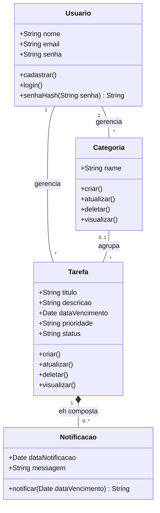
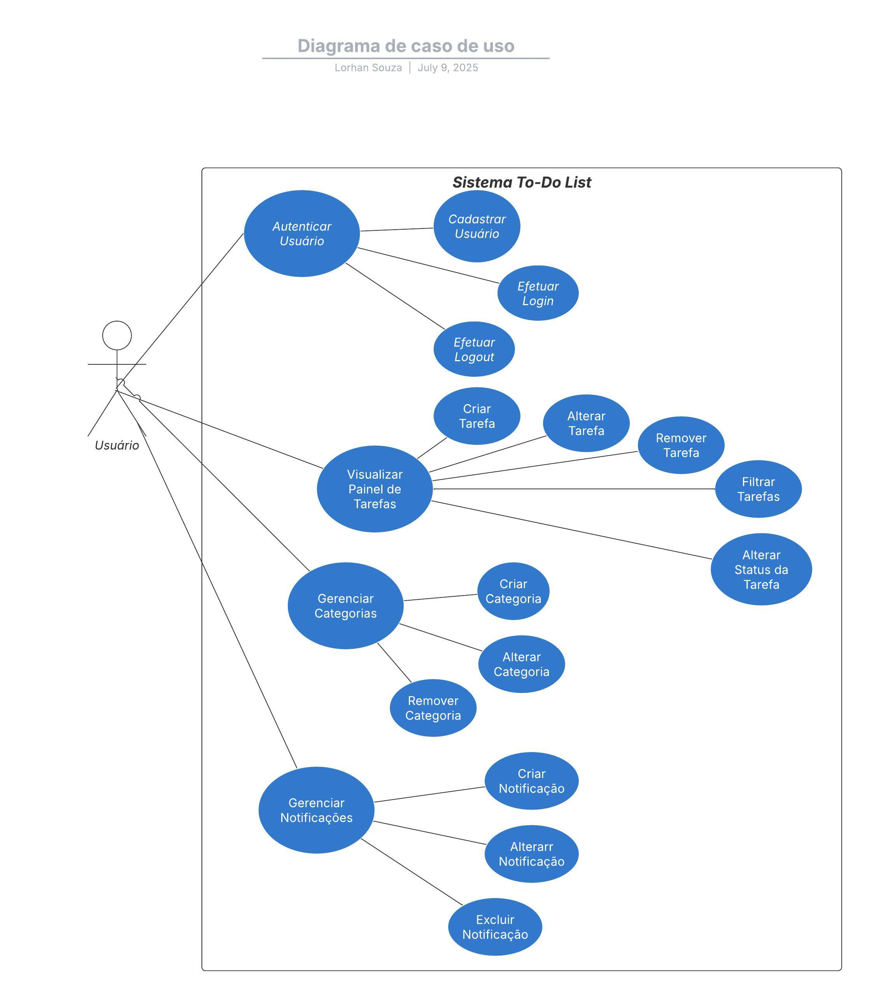
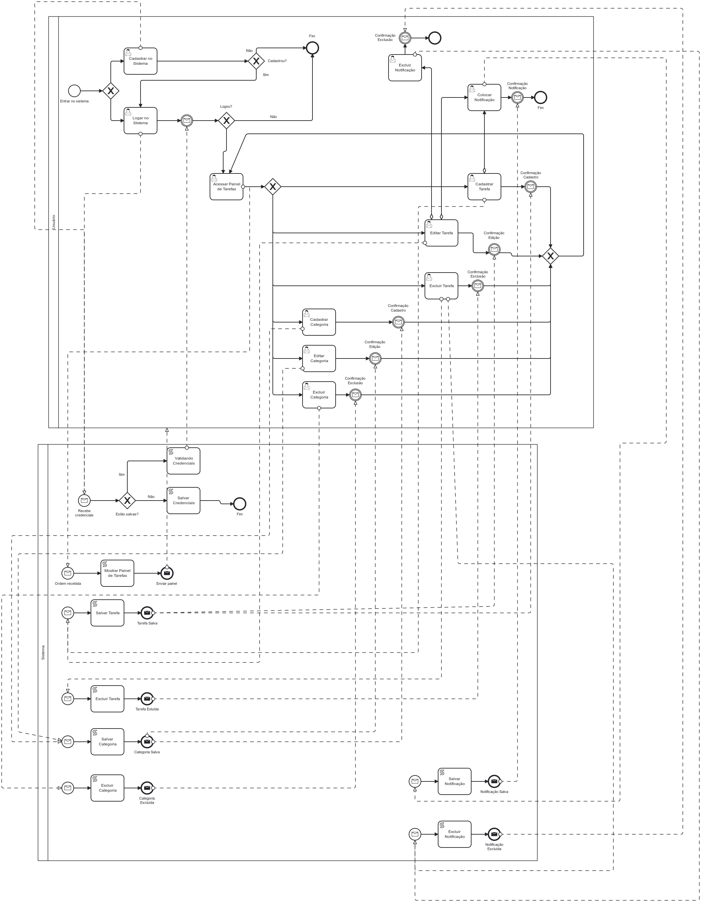

# Especificação de Requisitos - Sistema To-Do List

**Data de Criação:** 2025-07-07
**Autor:** Lorhan de Souza

---

## Sumário
1. [Introdução](#introdução)
2. [Propósito do Sistema](#propósito-do-sistema)
3. [Descrição do Minimundo](#descrição-do-minimundo)
4. [Requisitos Funcionais](#requisitos-funcionais)
    - [Gerenciamento de Usuários](#gerenciamento-de-usuários)
    - [Gerenciamento de Tarefas](#gerenciamento-de-tarefas)
    - [Gerenciamento de Categorias](#gerenciamento-de-categorias)
    - [Notificações](#notificações)
5. [Requisitos Não Funcionais](#requisitos-não-funcionais)
    - [Segurança](#segurança)
    - [Usabilidade e Responsividade](#usabilidade-e-responsividade)
    - [Desempenho](#desempenho)
    - [Confiabilidade](#confiabilidade)
6. [Diagrama de Classes](#diagrama-de-classes)
7. [Diagrama de Casos de Uso](#diagrama-de-casos-de-uso)
8. [Diagrama BPMN](#diagrama-bpmn)
9. [Arquitetura Sugerida](#arquitetura-sugerida)
10. [Tecnologias Sugeridas](#tecnologias-sugeridas)
---

## Introdução

Este documento detalha os requisitos funcionais e não funcionais para o sistema To-Do List, conforme descrito no mini-mundo fornecido no arquivo README.md.

## Propósito do Sistema

O propósito do sistema é auxiliar o usuário no gerenciamento de suas tarefas diárias criando, editando, excluindo e visualizando tarefas, bem como organização por categorias e acompanhamento do status da tarefa.

## Descrição do Minimundo

O sistema **To-Do List** tem como objetivo auxiliar **usuários** no gerenciamento de suas tarefas diárias. Cada **usuário** pode se cadastrar no sistema informando seu **nome**, **email** e **senha**, sendo que cada conta é individual e protegida por autenticação segura.

Após o login, o **usuário** acessa seu **painel de tarefas**, onde pode **criar, editar, excluir e visualizar suas tarefas**. Cada tarefa possui informações como **título, descrição, data de vencimento, prioridade, status e, opcionalmente, uma categoria**.

As tarefas são organizadas por **categorias**, que também são criadas e gerenciadas pelos próprios usuários. Isso permite que cada um personalize seu ambiente de organização, separando tarefas por contextos como **trabalho, estudos ou pessoal**.

O sistema permite que o usuário acompanhe o **status das tarefas**, que podem estar como **pendente, em andamento, concluída ou cancelada**. Além disso, oferece filtros para visualização das tarefas por **status, data de vencimento, prioridade e categoria**, facilitando o controle e o planejamento.

O sistema também pode, de forma opcional, enviar **notificações ou lembretes** sobre tarefas próximas do vencimento, mantendo os usuários informados e ajudando na gestão do tempo.

Todo o ambiente do sistema é seguro, com **senhas criptografadas**, e funciona de forma responsiva, adaptando-se tanto para **desktop quanto para dispositivos móveis**, garantindo uma boa experiência de uso.

## Requisitos Funcionais

### Gerenciamento de Usuários

| Identificador           | RF001 - Cadastro de Usuário |
|----------------|--------------|
| Descrição       | O sistema deve permitir que um novo usuário se cadastre informando nome, email e senha. | 
| Origem           | Minimundo          |
| Responsável | Lorhan de Souza   |
| Interessados            | Paulo Sérgio dos Santos Júnior                 |
| Prioridade           | [ ] Opcional [ ] Desejável [ x ] Obrigatório         |
| Dependências           |   -        |
| Conflitos           | -          |

| Identificador           | RF002 - Autenticação de Usuário |
|----------------|--------------|
| Descrição       | O sistema deve permitir que um usuário já cadastrado faça login utilizando seu email e senha. | 
| Origem           | Minimundo          |
| Responsável | Lorhan de Souza   |
| Interessados            | Paulo Sérgio dos Santos Júnior                 |
| Prioridade           | [ ] Opcional [ ] Desejável [ x ] Obrigatório         |
| Dependências           |   -        |
| Conflitos           | -          |

| Identificador           | RF003 - Proteção de Conta |
|----------------|--------------|
| Descrição       | Cada conta de usuário deve ser individual e protegida por autenticação segura. | 
| Origem           | Minimundo          |
| Responsável | Lorhan de Souza   |
| Interessados            | Paulo Sérgio dos Santos Júnior                 |
| Prioridade           | [ ] Opcional [ ] Desejável [ x ] Obrigatório         |
| Dependências           | RNF001        |
| Conflitos           | -          |

## Gerenciamento de Tarefas

| Identificador           | RF004 - Visualização do Painel de Tarefas |
|----------------|--------------|
| Descrição       | O sistema deve exibir um painel de tarefas personalizado para o usuário após o login |
| Origem           | Minimundo          |
| Responsável | Lorhan de Souza   |
| Interessados            | Paulo Sérgio dos Santos Júnior                 |
| Prioridade           | [ ] Opcional [ ] Desejável [x] Obrigatório         |
| Dependências           |  RF002        |
| Conflitos           | -          |

| Identificador           | RF005 - Criação de Tarefa |
|----------------|--------------|
| Descrição       | O sistema deve permitir que o usuário crie uma nova tarefa, informando título, descrição, data de vencimento, prioridade, status e, opcionalmente, uma categoria |
| Origem           | Minimundo          |
| Responsável | Lorhan de Souza   |
| Interessados            | Paulo Sérgio dos Santos Júnior                 |
| Prioridade           | [ ] Opcional [ ] Desejável [x] Obrigatório         |
| Dependências           |  RF002, RF004        |
| Conflitos           | -          |

| Identificador           | RF006 - Edição de Tarefa |
|----------------|--------------|
| Descrição       | O sistema deve permitir que o usuário edite as informações de uma tarefa existente |
| Origem           | Minimundo          |
| Responsável | Lorhan de Souza   |
| Interessados            | Paulo Sérgio dos Santos Júnior                 |
| Prioridade           | [ ] Opcional [ ] Desejável [x] Obrigatório         |
| Dependências           |  RF005        |
| Conflitos           | -          |

| Identificador           | RF007 - Exclusão de Tarefa |
|----------------|--------------|
| Descrição       | O sistema deve permitir que o usuário exclua uma tarefa existente |
| Origem           | Minimundo          |
| Responsável | Lorhan de Souza   |
| Interessados            | Paulo Sérgio dos Santos Júnior                 |
| Prioridade           | [ ] Opcional [ ] Desejável [x] Obrigatório         |
| Dependências           |  RF005        |
| Conflitos           | RF005          |

| Identificador           | RF008 - Filtro de Tarefas |
|----------------|--------------|
| Descrição       | O sistema deve permitir que o usuário visualize suas tarefas com base em filtros por status, data de vencimento, prioridade e categoria |
| Origem           | Minimundo          |
| Responsável | Lorhan de Souza   |
| Interessados            | Paulo Sérgio dos Santos Júnior                 |
| Prioridade           | [ ] Opcional [ ] Desejável [x] Obrigatório         |
| Dependências           |  RF004, RF005, RF009        |
| Conflitos           | -          |

| Identificador           | RF009 - Status da Tarefa |
|----------------|--------------|
| Descrição       | O sistema deve permitir que o usuário altere o status de uma tarefa existente |
| Origem           | Minimundo          |
| Responsável | Lorhan de Souza   |
| Interessados            | Paulo Sérgio dos Santos Júnior                 |
| Prioridade           | [ ] Opcional [ ] Desejável [x] Obrigatório         |
| Dependências           |  RF005        |
| Conflitos           | -          |

## Gerenciamento de Categorias

| Identificador           | RF010 - Criação de Categoria |
|----------------|--------------|
| Descrição       | O sistema deve permitir que o usuário crie novas categorias para organizar suas tarefas |
| Origem           | Minimundo          |
| Responsável | Lorhan de Souza   |
| Interessados            | Paulo Sérgio dos Santos Júnior                 |
| Prioridade           | [ ] Opcional [ ] Desejável [x] Obrigatório         |
| Dependências           |   -        |
| Conflitos           | -          |

| Identificador           | RF011 - Gerenciamento de Categorias |
|----------------|--------------|
| Descrição       | O sistema deve permitir que o usuário gerencie suas categorias (editar e excluir) | 
| Origem           | Minimundo          |
| Responsável | Lorhan de Souza   |
| Interessados            | Paulo Sérgio dos Santos Júnior                 |
| Prioridade           | [ ] Opcional [ ] Desejável [x] Obrigatório         |
| Dependências           | RF010        |
| Conflitos           | -          |

## Notificações

| Identificador           | RF012 - Criação de Noticações ou Lembretes |
|----------------|--------------|
| Descrição       | O sistema deve permitir que o usuário crie novas notificações/lembretes para organizar suas tarefas |
| Origem           | Minimundo          |
| Responsável | Lorhan de Souza   |
| Interessados            | Paulo Sérgio dos Santos Júnior                 |
| Prioridade           | [x] Opcional [ ] Desejável [ ] Obrigatório         |
| Dependências           |   RF005        |
| Conflitos           | RF005          |

| Identificador           | RF013 - Gerenciamento de Notificações ou Lembretes |
|----------------|--------------|
| Descrição       | O sistema deve permitir que o usuário gerencie suas notidicações ou lembestes (editar e excluir) | 
| Origem           | Minimundo          |
| Responsável | Lorhan de Souza   |
| Interessados            | Paulo Sérgio dos Santos Júnior                 |
| Prioridade           | [x] Opcional [ ] Desejável [ ] Obrigatório         |
| Dependências           | RF012        |
| Conflitos           | -          |

| Identificador           | RF014 - Notificações e Lembretes |
|----------------|--------------|
| Descrição       | O sistema deve enviar notificações ou lembretes sobre tarefas próximas do vencimento | 
| Origem           | Minimundo          |
| Responsável | Lorhan de Souza   |
| Interessados            | Paulo Sérgio dos Santos Júnior                 |
| Prioridade           | [x] Opcional [ ] Desejável [ ] Obrigatório         |
| Dependências           | RF012        |
| Conflitos           | -          |

## Requisitos Não Funcionais

### Segurança

| Identificador           | RNF001 - Criptografia de Senhas |
|----------------|--------------|
| Descrição       | As senhas dos usuários devem ser armazenadas de forma criptografada para garantir a segurança |
| Origem           | Minimundo          |
| Responsável | Lorhan de Souza   |
| Interessados            | Paulo Sérgio dos Santos Júnior                 |
| Prioridade           | [ ] Opcional [ ] Desejável [x] Obrigatório         |
| Dependências           |   -        |
| Conflitos           | -          |

### Usabilidade e Responsividade

| Identificador           | RNF002 - Responsividade |
|----------------|--------------|
| Descrição       | O sistema deve ser responsivo, adaptando-se para desktop e dispositivos móveis, garantindo uma boa experiência de uso em diferentes plataformas. |
| Origem           | Minimundo          |
| Responsável | Lorhan de Souza   |
| Interessados            | Paulo Sérgio dos Santos Júnior                 |
| Prioridade           | [ ] Opcional [ ] Desejável [x] Obrigatório         |
| Dependências           |   -        |
| Conflitos           | -          |

### Desempenho

| Identificador           | RNF003 - Tempo de Resposta |
|----------------|--------------|
| Descrição       | O sistema deve apresentar um tempo de resposta adequado para as operações de criação, edição, exclusão e visualização de tarefas e categorias, garantindo uma experiência fluida ao usuário | 
| Origem           | Levantamento de Requisitos          |
| Responsável | Lorhan de Souza   |
| Interessados            | Paulo Sérgio dos Santos Júnior                 |
| Prioridade           | [ ] Opcional [x] Desejável [ ] Obrigatório         |
| Dependências           |   -        |
| Conflitos           | -          |

Tabela de Tempo de Resposta Ideal

### Confiabilidade

| Identificador           | RNF004 - Disponibilidade |
|----------------|--------------|
| Descrição       | O sistema deve estar disponível para uso 24 horas por dia, 7 dias por semana, com um mínimo de interrupções |
| Origem           | Levantamento de Requisito          |
| Responsável | Lorhan de Souza   |
| Interessados            | Paulo Sérgio dos Santos Júnior                 |
| Prioridade           | [ ] Opcional [x] Desejável [ ] Obrigatório         |
| Dependências           |   -        |
| Conflitos           | -          |

| Identificador           | RNF005 - Integridade dos Dados |
|----------------|--------------|
| Descrição       | O sistema deve garantir a integridade dos dados das tarefas e categorias, evitando perdas ou corrupção de informações |
| Origem           | Levantamento de Requisito          |
| Responsável | Lorhan de Souza   |
| Interessados            | Paulo Sérgio dos Santos Júnior                 |
| Prioridade           | [ ] Opcional [ ] Desejável [x] Obrigatório         |
| Dependências           |   -        |
| Conflitos           | -          |

### Diagrama de Classes

O diagrama de classes a seguir representa a estrutura estática do sistema To-Do List, mostrando as classes, seus atributos, métodos e os relacionamentos entre elas.

## Diagrama de Casos de Uso

O diagrama de casos de uso ilustra as interações entre os atores e o sistema, representando as funcionalidades principais do sistema To-Do List.

 

 

## Diagrama BPMN

O diagrama BPMN ilustra os processos entre o usuário e o sistema, representando os processos principais do sistema To-Do List.

 

 
O diagrama em notação BPMN encontra-se clicando <a href="Diagramas/BPMN">aqui</a>

## Arquitetura Sugerida

A arquitetura sugerida segue um padrão MVC (Model-View-Controller), dividindo o sistema em três camadas principais:

- Model: representa as entidades do sistema (Usuário, Tarefa, Categoria, Notificações)  
- View: interface gráfica interativa para interação com o usuário  
- Controller: camada de controle que gerencia as requisições e aplica as regras de negócio  

## Tecnologias Sugeridas

- Frontend: Vue.js com TailWind / React
- Backend: Node.js + Express / Flask / C# (.NET)
- Banco de Dados: PostgreSQL / MySQL
- Autenticação: JWT
- Notificações: Email API e/ou via sistema
- Hospedagem: AWS / Azure
